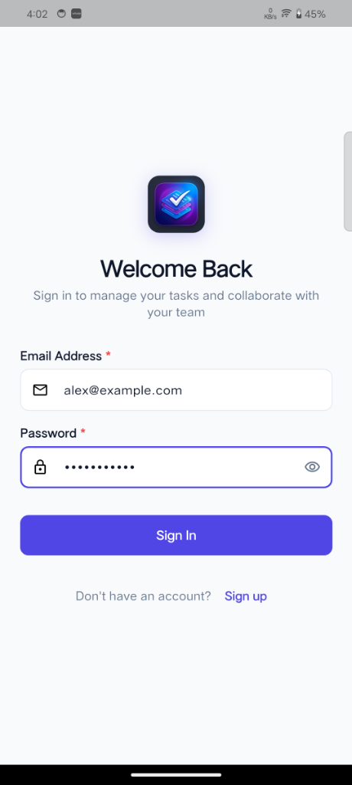
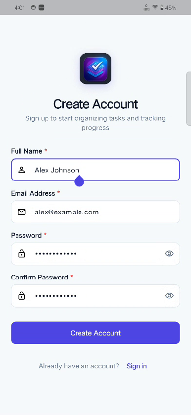
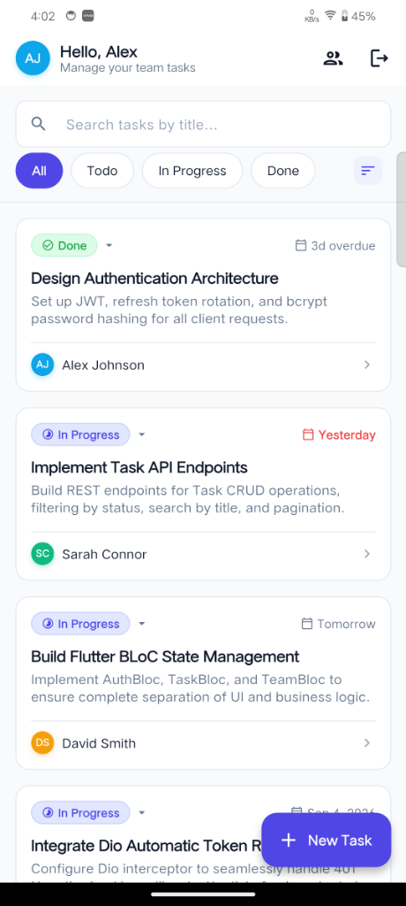
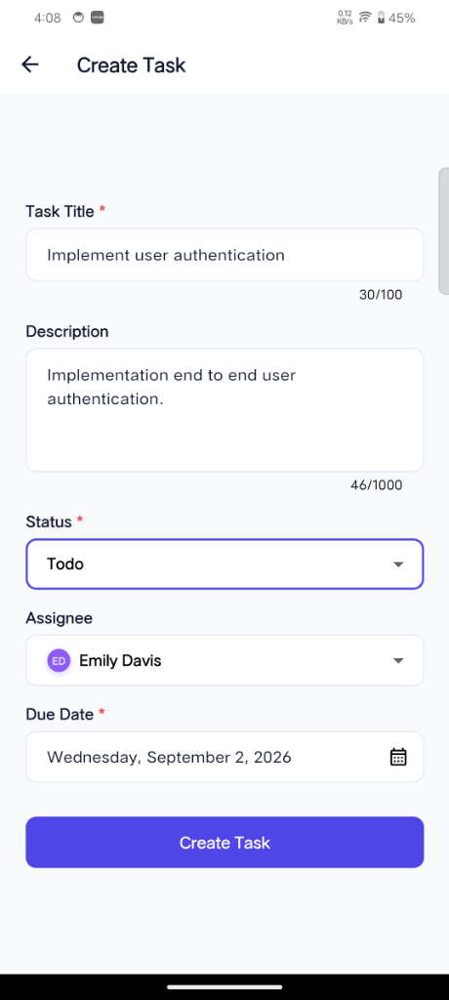
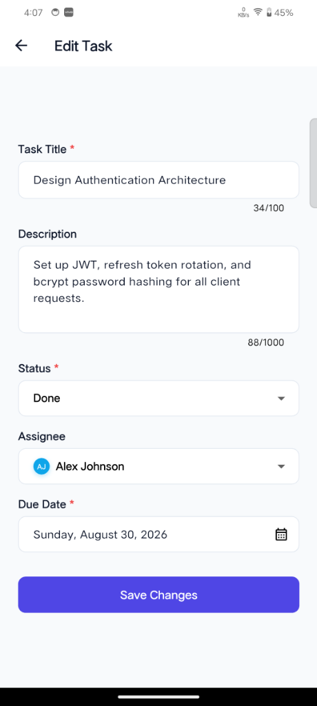
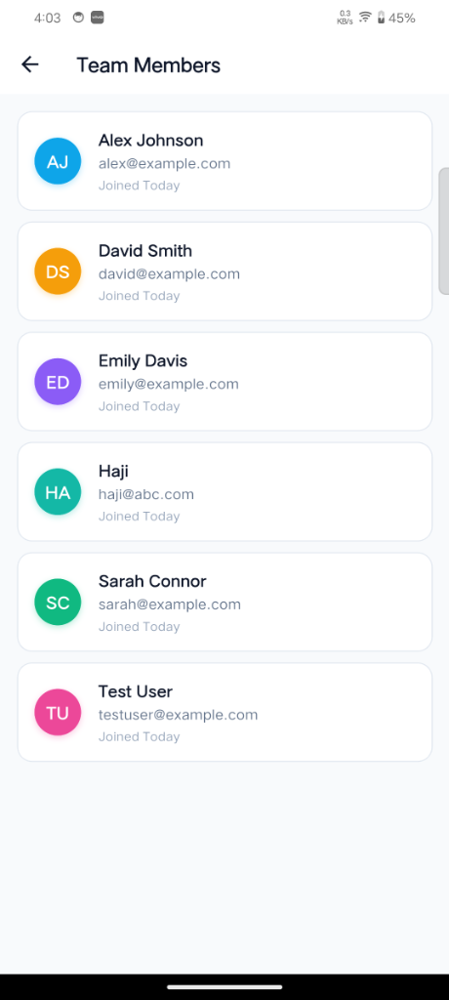
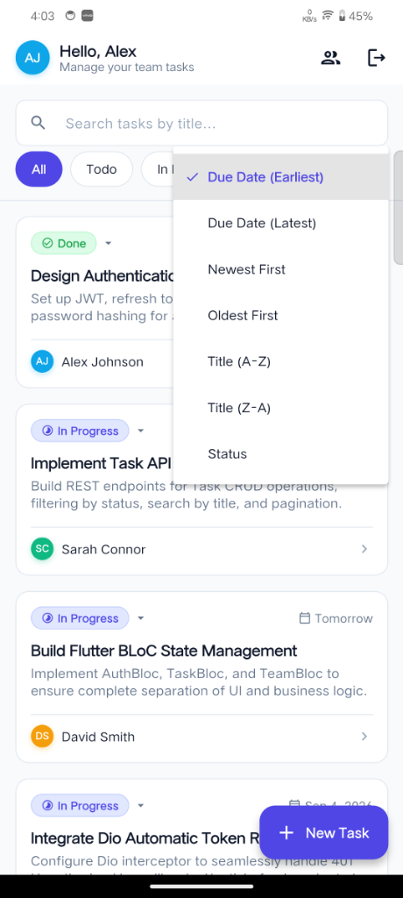

# 📋 Task Manager — Full-Stack Monorepo

A robust, enterprise-grade full-stack **Task Manager** application composed of a **Node.js (Express + MySQL + JavaScript)** backend API service and a cross-platform **Flutter (BLoC + Dio + GoRouter)** client application.

---

## ⏱️ Task Timing & Overview

* **Start Time:** ~12:30 PM
* **Finish Time:** ~4:30 PM
* **Total Time Taken:** ~4.5 Hours (within the 4–6 hour expectation)
* **Status:** 100% Completed & Verified

---

## 📁 Repository Structure & Sub-Project Documentation

This monorepo contains two independent, dedicated projects with their own separate README guides:

```
assignment/
├── backend/                  # Node.js + Express + MySQL REST API Backend
│   └── README.md             # 📖 Detailed Backend Documentation
├── task_manager_app/         # Flutter Cross-Platform Client Application
│   └── README.md             # 📖 Detailed Flutter App Documentation
├── README.md                 # 📖 Root Monorepo Guide (this file)
└── ...
```

* 👉 **Backend Guide**: [backend/README.md](file:///d:/assignment/backend/README.md)
* 👉 **Frontend Guide**: [task_manager_app/README.md](file:///d:/assignment/task_manager_app/README.md)

---

## 🏗️ System Architecture

```
┌────────────────────────────────────────────────────────┐
│             Flutter App (task_manager_app)             │
│  UI Screens ──> BLoC (Auth/Task/Team) ──> Repository   │
│                          │                             │
│                    Dio API Client                      │
│        (Auto 401 Token Refresh Interceptor)            │
│        (SecureStorage: accessToken/refreshToken)       │
└───────────────────────────┬────────────────────────────┘
                            │ HTTP / JSON (Port 3000)
┌───────────────────────────▼────────────────────────────┐
│              Node.js Express Backend (JS)              │
│  Router ──> Middleware (Auth/Zod) ──> Controller       │
│                     │                                  │
│                  Service                               │
│                     │                                  │
│                Repository                              │
│                     │                                  │
│             MySQL Connection Pool                      │
│     (users, refresh_tokens, tasks tables)              │
└────────────────────────────────────────────────────────┘
```

---

## ⚡ Quick Start

### 1. Start the Backend
```bash
cd backend
npm install
npm run db:migrate
npm run db:seed
npm run dev
# Running on http://localhost:3000
```

### 2. Start the Flutter App
```bash
cd task_manager_app
flutter pub get

# For Android USB debugging:
adb reverse tcp:3000 tcp:3000

flutter run
```

---

## 🔑 Demo Credentials (from Seed Data)

All demo accounts use the password: `password123`

| Name | Email | Role |
|---|---|---|
| **Alex Johnson** | `alex@example.com` | Team Lead / Admin |
| **Sarah Connor** | `sarah@example.com` | Engineer |
| **David Smith** | `david@example.com` | Designer |
| **Emily Davis** | `emily@example.com` | Product Manager |

---

## 📸 Application Screenshots

| 01. Welcome Back (Login) | 02. Create Account (Signup) |
|:---:|:---:|
|  |  |

| 03. Task List & Live Badges | 04. Create Task |
|:---:|:---:|
|  |  |

| 05. Edit Task Form | 06. Team Members Directory |
|:---:|:---:|
|  |  |

| 07. Sorting & Filtering Options |
|:---:|
|  |


---

## 💡 Key Design & Engineering Decisions

### 1. Frontend: Flutter + BLoC State Management
* **Clean Architecture Layers:** Strict separation of concerns across Data (Models & Repositories), Core (Storage, Network, Theme, Validators), and Presentation (BLoCs, Screens, Widgets).
* **BLoC Pattern (`AuthBloc`, `TaskBloc`, `TeamBloc`):** Unidirectional data flow (`Event ➔ BLoC ➔ State`) provides predictable state transitions and effortless unit testing without UI dependencies.
* **Queued Token Refresh Interceptor:** Uses `Dio` interceptors with a retry lock to automatically catch `401 Unauthorized`, request a token refresh using the stored refresh token in `flutter_secure_storage`, and re-dispatch pending requests without user interruption.
* **Form UX & Defensive Controls:** Automated scrolling to the first invalid form field upon submission, auto-capitalization on Full Name, and debounce locks on search and multiple button taps.

### 2. Backend: Layered Node.js + Express + MySQL
* **Layered Architecture:** Routes ➔ Controllers ➔ Services ➔ Repositories ➔ Database Pool.
* **Security & Auth:** Short-lived JWT Access Tokens (15 min) paired with cryptographically secure random Refresh Tokens (7 days) hashed with SHA-256 and stored in MySQL with full rotation and revocation support.
* **Input Validation:** Strict Zod schema validation middleware returning structured, field-level error messages with standard HTTP status codes (`400`, `401`, `403`, `404`, `409`, `500`).
* **Database Design:** Foreign keys with cascade constraints, indexed foreign keys (`assignee_id`, `created_by_id`, `status`, `due_date`), and automated database migration/seeding scripts.

---

## 🧪 Verification & Test Results

* **Backend Tests (`npm test` in `backend/`)**: All 14 integration tests passing.
* **Flutter Tests (`flutter test` in `task_manager_app/`)**: All 16 unit & widget tests passing.
* **Flutter Code Quality (`flutter analyze`)**: 0 issues found.

